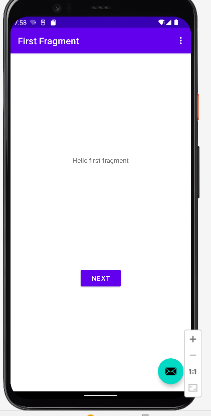
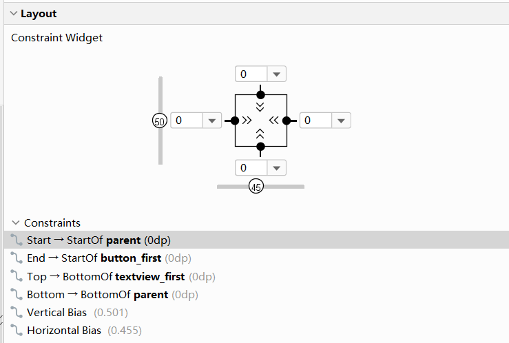
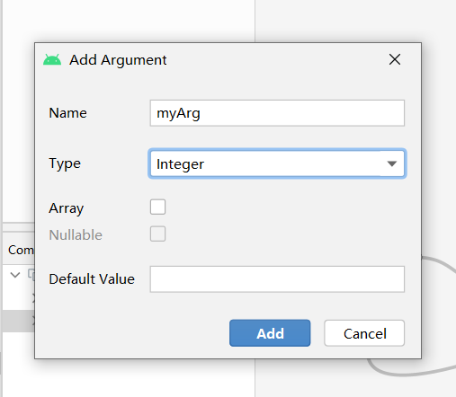

#  exp1  安装软件
## 1.安装anaconda
1.进入官网，下载Anaconda


2.安装完毕后验证，在终端输入：condalist ，可以查看已经安装的包名和版本号。若结果可以正常显示，则说明安装成功。


## 2.使用Anaconda Navigator启动Notebook
1.启动Anaconda Navigator导航界面，并从导航界面启动Jupyter Notebook。


2.或者使用终端进行启动，如：


3.启动后呈现默认界面：


## 3.修改默认加载目录
1.找到本地用户文件夹中找到jupyter_notebook_config.py文件，修改文件中的/c.NotebookApp.notebook_dir的目录，定位到自己想要的加载文件夹下，例如：


2.重新启动后界面如：


## 4.查看布局并写一写代码
1.在启动界面新建文件


2.顶部可以修改文件名，ctrl+enter可以运行当前代码框的代码，enter+enter可以快速进入编辑。


以上为本次实验大致内容，notebook是一个非常方便的页面编辑器，实施编译功能方便。

# exp2 实验教程
## 1.创建第一个Kotlin应用
- 常见一个创建一个new projiect，选择BAsics Activity，选择Kotlin语言，取名为Exp2。编译并生成应用。


## 2.调整布局和约束,更改组件外观



在firstFragment中，调整如代码所示：
```
 <TextView
        android:id="@+id/textview_first"
        android:layout_width="wrap_content"
        android:layout_height="wrap_content"
        android:fontFamily="sans-serif-condensed"
        android:text="@string/hello_first_fragment"
        android:textColor="@color/white"
        android:textSize="72sp"
        app:layout_constraintBottom_toBottomOf="parent"
        app:layout_constraintEnd_toEndOf="parent"
        app:layout_constraintStart_toStartOf="parent"
        app:layout_constraintTop_toTopOf="parent"
        app:layout_constraintVertical_bias="0.3" />

    <Button
        android:id="@+id/random_button"
        android:layout_width="wrap_content"
        android:layout_height="wrap_content"
        android:layout_marginEnd="24dp"
        android:background="@color/buttonBackgroud"
        android:text="@string/random_button_text"
        app:layout_constraintBottom_toBottomOf="parent"
        app:layout_constraintEnd_toEndOf="parent"
        app:layout_constraintTop_toBottomOf="@+id/textview_first"
        app:layout_constraintVertical_bias="0.501" />

    <Button
        android:id="@+id/toast_button"
        android:layout_width="wrap_content"
        android:layout_height="wrap_content"
        android:background="@color/buttonBackgroud"
        android:text="@string/toast_button_text"
        app:layout_constraintBottom_toBottomOf="parent"
        app:layout_constraintEnd_toStartOf="@+id/random_button"
        app:layout_constraintHorizontal_bias="0.24"
        app:layout_constraintStart_toStartOf="parent"
        app:layout_constraintTop_toBottomOf="@id/textview_first"
        app:layout_constraintVertical_bias="0.501"
        tools:ignore="TextContrastCheck" />

    <Button
        android:id="@+id/count_button"
        android:layout_width="wrap_content"
        android:layout_height="wrap_content"
        android:background="@color/buttonBackgroud"
        android:text="@string/count_button_text"
        app:layout_constraintBottom_toBottomOf="parent"
        app:layout_constraintEnd_toStartOf="@+id/random_button"
        app:layout_constraintStart_toEndOf="@+id/toast_button"
        app:layout_constraintTop_toBottomOf="@+id/textview_first" />
 ```

在SecondFragment
```
<TextView
        android:id="@+id/textview_header"
        android:layout_width="0dp"
        android:layout_height="wrap_content"
        android:layout_marginStart="24dp"
        android:layout_marginLeft="24dp"
        android:layout_marginTop="24dp"
        android:layout_marginEnd="24dp"
        android:layout_marginRight="24dp"
        android:text="@string/random_heading"
        android:textColor="@color/colorPrimaryDark"
        android:textSize="24sp"
        app:layout_constraintEnd_toEndOf="parent"
        app:layout_constraintStart_toStartOf="parent"
        app:layout_constraintTop_toTopOf="parent" />

    <Button
        android:id="@+id/button_second"
        android:layout_width="wrap_content"
        android:layout_height="wrap_content"
        android:layout_marginBottom="36dp"
        android:text="@string/previous"
        app:layout_constraintBottom_toBottomOf="parent"
        app:layout_constraintEnd_toEndOf="parent"
        app:layout_constraintHorizontal_bias="0.498"
        app:layout_constraintStart_toStartOf="parent" />

    <TextView
        android:id="@+id/textView_random"
        android:layout_width="wrap_content"
        android:layout_height="wrap_content"
        android:text="R"
        android:textColor="@color/white"
        android:textSize="72sp"
        android:textStyle="bold"
        app:layout_constraintBottom_toTopOf="@id/button_second"
        app:layout_constraintEnd_toEndOf="parent"
        app:layout_constraintStart_toStartOf="parent"
        app:layout_constraintTop_toBottomOf="@id/textview_header" />
```


## 3.添加SafeArgs

在buildscrip的dependencies中添加代码，如图：
```
buildscript {
    repositories {
        google()
    }
    dependencies {
//        val nav_version = "2.4.2"
        classpath("androidx.navigation:navigation-safe-args-gradle-plugin:2.4.2")
    }
}
```
在module中添加代码：
```
plugins {
    id 'com.android.application'
    id 'org.jetbrains.kotlin.android'
    id 'androidx.navigation.safeargs'
//    id("androidx.navigation.safeargs")
//    id("androidx.navigation.safeargs.kotlin")


}
```

之后重新gradle。


还要添加导航动作参数。
在导航视图中，添加对应属性，如图：



## 4.添加交互代码

在firstfregrament中添加
```
override fun onViewCreated(view: View, savedInstanceState: Bundle?) {
        super.onViewCreated(view, savedInstanceState)

        binding.randomButton.setOnClickListener {
//            findNavController().navigate(R.id.action_FirstFragment_to_SecondFragment)
            val showCountTextView = view.findViewById<TextView>(R.id.textview_first)
            val currentCount = showCountTextView.text.toString().toInt()
            val action = FirstFragmentDirections.actionFirstFragmentToSecondFragment(currentCount)
            findNavController().navigate(action)

        }
        // find the toast_button by its ID and set a click listener
        view.findViewById<Button>(R.id.toast_button).setOnClickListener {
            // create a Toast with some text, to appear for a short time
            val myToast = Toast.makeText(context, "Hello Toast!", Toast.LENGTH_LONG)
            // show the Toast
            myToast.show()


        }
        view.findViewById<Button>(R.id.count_button).setOnClickListener {
            countMe(view)
        }
    }
```
在second中添加：
```
 override fun onViewCreated(view: View, savedInstanceState: Bundle?) {
        super.onViewCreated(view, savedInstanceState)
        val count = args.myArg
        val countText = getString(R.string.random_heading, count)
        view.findViewById<TextView>(R.id.textview_header).text = countText
        val random = java.util.Random()
        var randomNumber = 0
        if (count > 0) {
            randomNumber = random.nextInt(count + 1)
        }
        view.findViewById<TextView>(R.id.textView_random).text = randomNumber.toString()

        binding.buttonSecond.setOnClickListener {
            findNavController().navigate(R.id.action_SecondFragment_to_FirstFragment)
        }


    }
```

## 5.运行并查看成果


