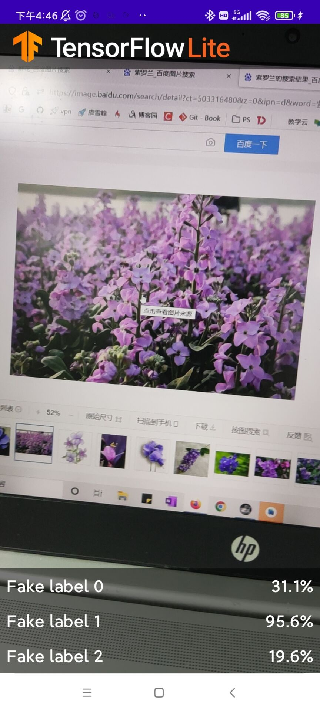
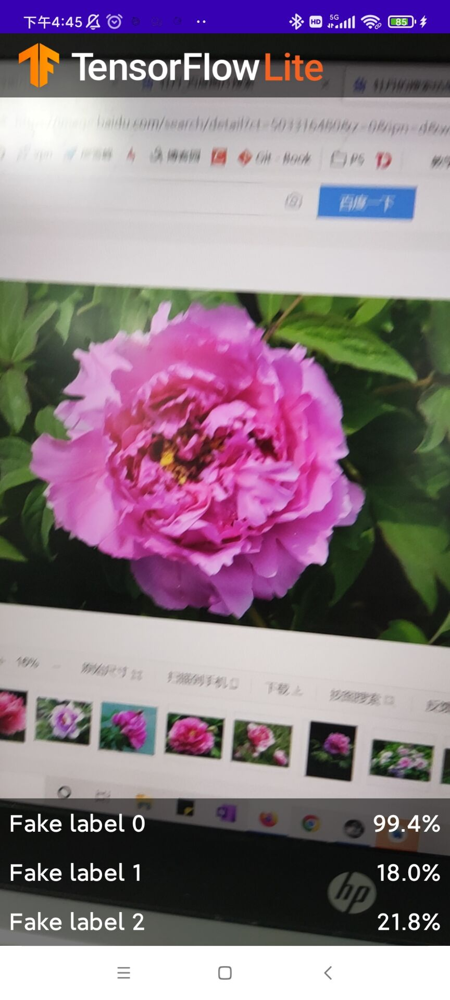
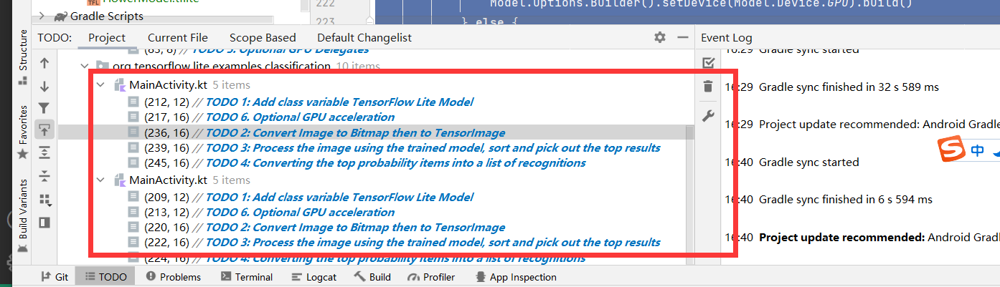
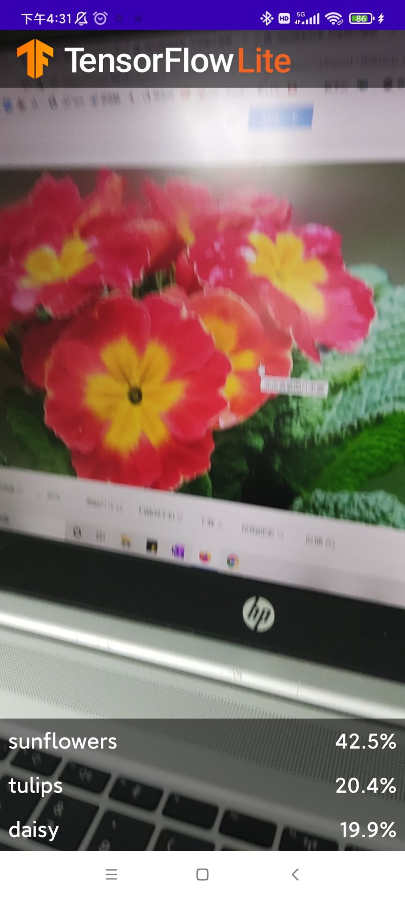
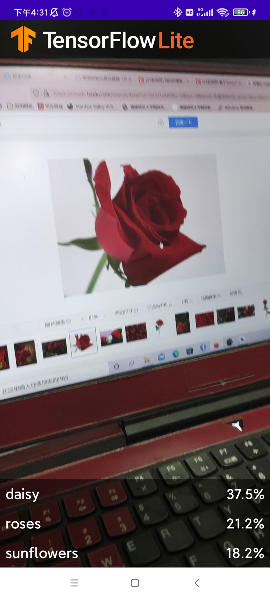

# 实验三教程

本实验将使用TensorFlow Lite运行图像识别模型。

## 1.首先在的github上clone本模型框架,并在AS上运行。
- git clone https://github.com/hoitab/TFLClassify.git
- 打开Android studio,选择打开已有项目，项目地址为为自己本机clone该项目的地址。
- 打开后AS会自动进行gradle
- 将物理机连接上AS，在物理机上运行start模块
（物理机需要打开开发这模式才可以运行，如果是华为则进入设置-->关于手机-->版本号,连续戳版本号十次则可进入开发者模式，如图所示)


- 运行后可以看到如下界面


## 2向应用中添加TensorFlow Lite
选择File，然后New>Other>TensorFlow Lite Mode,添加模型过程如图所示：


## 3.检查代码中的TODO项
本项目初始代码中包括了若干的TODO项，以导航项目中未完成之处。为了方便起见，首先查看TODO列表视图，View>Tool Windows>TODO

## 4.在start里面添加代码，并重新运行

根据定位，在对应位置添加代码：
- TODO 1,初始化训练模型的代码

```
private class ImageAnalyzer(ctx: Context, private val listener: RecognitionListener) :
        ImageAnalysis.Analyzer {

  ...
  // TODO 1: Add class variable TensorFlow Lite Model
  private val flowerModel = FlowerModel.newInstance(ctx)

  ...
}
```
- TODO 2 将图形进行转换
```

override fun analyze(imageProxy: ImageProxy) {
  ...
  // TODO 2: Convert Image to Bitmap then to TensorImage
  val tfImage = TensorImage.fromBitmap(toBitmap(imageProxy))
  ...
}
```
- TODO 3    将识别出来的结果可能性按照大小从高到低排序
```
override fun analyze(imageProxy: ImageProxy) {
  ...
  // TODO 3: Process the image using the trained model, sort and pick out the top results
  val outputs = flowerModel.process(tfImage)
      .probabilityAsCategoryList.apply {
          sortByDescending { it.score } // Sort with highest confidence first
      }.take(MAX_RESULT_DISPLAY) // take the top results

  ...
}
```
- TODO 4识别的结果加入显示控件中
```
override fun analyze(imageProxy: ImageProxy) {
  ...
  // TODO 4: Converting the top probability items into a list of recognitions
  for (output in outputs) {
      items.add(Recognition(output.label, output.score))
  }
  ...
}
```
- TODO 5 删除不必要的注释。
```
// START - Placeholder code at the start of the codelab. Comment this block of code out.
for (i in 0..MAX_RESULT_DISPLAY-1){
    items.add(Recognition("Fake label $i", Random.nextFloat()))
}
// END - Placeholder code at the start of the codelab. Comment this block of code out.
```
保存后重新运行该程序，得到结果如图。搜一些花的图片进行识别:




