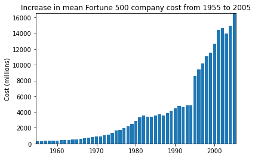

# 一.利用jupyer跑python代码，并且进行简单的数据处理

# 0.记录一下常用的快捷键:
- 1.命令行模式下 H 可以打开查看常用快捷键(esc可以从编辑模式退出到命令行模式。
- 2.命令行模式下A可以在上方插空格，B在下方。
- 3.shift + 上/下/K 可以自由切换代码块
- 4.ctrl + enter 运行选中的代码块，shift + enter 运行当前代码块并调到下一块

##  1.首先进行一个程序员都懂得hello world操作，然后利用用选择排序来熟悉一下python，代码如下：


```python
print("Hello World！")
```

    Hello World！
    


```python
import numpy as np
def square(x):
    return x*x

```


```python
x = np.random.randint(6,10)
y = square(x)
print("%d square is %d" % (x,y))
```

    7 square is 49
    


# 此处为选出排序的代码
def selection_sort(num):
    for i in range(0,len(num)-1):
        for j in range(i+1,len(num)-1):
            if num[i] >= num[j]:
                num[i],num[j]=num[j],num[i]
    return num;
            
def test():
    array = [10, 17, 50, 7, 30, 24, 27, 45, 15, 5, 36, 21]
    print(selection_sort(array))
    
test()
## 2.用pyhton进行数据处理，开始实战
现在下载数据，注意把数据保存在自己常用的位置，同时在读取文件时要写入该地址。


```python
# 导入相关的工具库，加载数据集。
%matplotlib inline
import pandas as pd
import matplotlib.pyplot as plt
import seaborn as sns
```


```python
df = pd.read_csv('G:/notebook/fortune500.csv')
# 导入后对数据集进行一系列地检查。并进行数据列重命名和清洗无用数据的操作。
df.head()
```


<div>
<style scoped>
    .dataframe tbody tr th:only-of-type {
        vertical-align: middle;
    }

    .dataframe tbody tr th {
        vertical-align: top;
    }

    .dataframe thead th {
        text-align: right;
    }
</style>
<table border="1" class="dataframe">
  <thead>
    <tr style="text-align: right;">
      <th></th>
      <th>Year</th>
      <th>Rank</th>
      <th>Company</th>
      <th>Revenue (in millions)</th>
      <th>Profit (in millions)</th>
    </tr>
  </thead>
  <tbody>
    <tr>
      <th>0</th>
      <td>1955</td>
      <td>1</td>
      <td>General Motors</td>
      <td>9823.5</td>
      <td>806</td>
    </tr>
    <tr>
      <th>1</th>
      <td>1955</td>
      <td>2</td>
      <td>Exxon Mobil</td>
      <td>5661.4</td>
      <td>584.8</td>
    </tr>
    <tr>
      <th>2</th>
      <td>1955</td>
      <td>3</td>
      <td>U.S. Steel</td>
      <td>3250.4</td>
      <td>195.4</td>
    </tr>
    <tr>
      <th>3</th>
      <td>1955</td>
      <td>4</td>
      <td>General Electric</td>
      <td>2959.1</td>
      <td>212.6</td>
    </tr>
    <tr>
      <th>4</th>
      <td>1955</td>
      <td>5</td>
      <td>Esmark</td>
      <td>2510.8</td>
      <td>19.1</td>
    </tr>
  </tbody>
</table>
</div>


```python
df.tail()
```


<div>
<style scoped>
    .dataframe tbody tr th:only-of-type {
        vertical-align: middle;
    }

    .dataframe tbody tr th {
        vertical-align: top;
    }

    .dataframe thead th {
        text-align: right;
    }
</style>
<table border="1" class="dataframe">
  <thead>
    <tr style="text-align: right;">
      <th></th>
      <th>Year</th>
      <th>Rank</th>
      <th>Company</th>
      <th>Revenue (in millions)</th>
      <th>Profit (in millions)</th>
    </tr>
  </thead>
  <tbody>
    <tr>
      <th>25495</th>
      <td>2005</td>
      <td>496</td>
      <td>Wm. Wrigley Jr.</td>
      <td>3648.6</td>
      <td>493</td>
    </tr>
    <tr>
      <th>25496</th>
      <td>2005</td>
      <td>497</td>
      <td>Peabody Energy</td>
      <td>3631.6</td>
      <td>175.4</td>
    </tr>
    <tr>
      <th>25497</th>
      <td>2005</td>
      <td>498</td>
      <td>Wendy's International</td>
      <td>3630.4</td>
      <td>57.8</td>
    </tr>
    <tr>
      <th>25498</th>
      <td>2005</td>
      <td>499</td>
      <td>Kindred Healthcare</td>
      <td>3616.6</td>
      <td>70.6</td>
    </tr>
    <tr>
      <th>25499</th>
      <td>2005</td>
      <td>500</td>
      <td>Cincinnati Financial</td>
      <td>3614.0</td>
      <td>584</td>
    </tr>
  </tbody>
</table>
</div>


```python
df.columns = ['year','rank','company','revenue','profit'] # 对表格竖栏数据命名
```


```python
len(df)
```


    25500


```python
df.dtypes   #查看数据格式
```


    year         int64
    rank         int64
    company     object
    revenue    float64
    profit      object
    dtype: object


```python
non_numberic_profits = df.profit.str.contains('[^0-9.-]')
df.loc[non_numberic_profits].head()              #通过正则表达式找出格式不对的数据
```


<div>
<style scoped>
    .dataframe tbody tr th:only-of-type {
        vertical-align: middle;
    }

    .dataframe tbody tr th {
        vertical-align: top;
    }

    .dataframe thead th {
        text-align: right;
    }
</style>
<table border="1" class="dataframe">
  <thead>
    <tr style="text-align: right;">
      <th></th>
      <th>year</th>
      <th>rank</th>
      <th>company</th>
      <th>revenue</th>
      <th>profit</th>
    </tr>
  </thead>
  <tbody>
    <tr>
      <th>228</th>
      <td>1955</td>
      <td>229</td>
      <td>Norton</td>
      <td>135.0</td>
      <td>N.A.</td>
    </tr>
    <tr>
      <th>290</th>
      <td>1955</td>
      <td>291</td>
      <td>Schlitz Brewing</td>
      <td>100.0</td>
      <td>N.A.</td>
    </tr>
    <tr>
      <th>294</th>
      <td>1955</td>
      <td>295</td>
      <td>Pacific Vegetable Oil</td>
      <td>97.9</td>
      <td>N.A.</td>
    </tr>
    <tr>
      <th>296</th>
      <td>1955</td>
      <td>297</td>
      <td>Liebmann Breweries</td>
      <td>96.0</td>
      <td>N.A.</td>
    </tr>
    <tr>
      <th>352</th>
      <td>1955</td>
      <td>353</td>
      <td>Minneapolis-Moline</td>
      <td>77.4</td>
      <td>N.A.</td>
    </tr>
  </tbody>
</table>
</div>


```python
len(df.profit[non_numberic_profits]) #查看有多少个
```


    369


```python
bin_sizes, _, _ = plt.hist(df.year[non_numberic_profits], bins=range(1955, 2006))
```


    

    


```python
df = df.loc[~non_numberic_profits]
df.profit = df.profit.apply(pd.to_numeric)  #将不对的数据格式清除，可以清除的原因是筛选出来的数据不多，清除后对原来的数据集影响不大
```


```python
len(df)
```


    25131


```python
df.dtypes   #再次查看profit的格式，可以知道已经清洗成功
```


    year         int64
    rank         int64
    company     object
    revenue    float64
    profit     float64
    dtype: object


```python
# 绘制数据图表
group_by_year = df.loc[:, ['year', 'revenue', 'profit']].groupby('year')
avgs = group_by_year.mean()
x = avgs.index
y1 = avgs.profit
def plot(x, y, ax, title, y_label):
    ax.set_title(title)
    ax.set_ylabel(y_label)
    ax.plot(x, y)
    ax.margins(x=0, y=0)

# 自己写的一个绘制柱形图的函数

def  bar(x,y,ax,title,y_label):
    ax.set_title(title)
    ax.set_ylabel(y_label)
    ax.bar(x, y)
    ax.margins(x=0, y=0)

```


```python
fig, ax = plt.subplots()
plot(x, y1, ax, 'Increase in mean Fortune 500 company profits from 1955 to 2005', 'Profit (millions)')
```


    

    


```python

```


```python
y2 = avgs.revenue
fig, ax = plt.subplots()
plot(x, y2, ax, 'Increase in mean Fortune 500 company revenues from 1955 to 2005', 'Revenue (millions)')

```


    

    


```python
# 自己尝试画一下支出图，依据公式为： 收入-支出= 利润  =》 支出 = 收入 - 利润。 
y3 = avgs.revenue - avgs.profit
fig, ax = plt.subplots()
bar(x, y2, ax, 'Increase in mean Fortune 500 company cost from 1955 to 2005', 'Cost (millions)')
```


    

    


```python
def plot_with_std(x, y, stds, ax, title, y_label):
    ax.fill_between(x, y - stds, y + stds, alpha=0.2)
    plot(x, y, ax, title, y_label)
fig, (ax1, ax2) = plt.subplots(ncols=2)
title = 'Increase in mean and std Fortune 500 company %s from 1955 to 2005'
stds1 = group_by_year.std().profit.values
stds2 = group_by_year.std().revenue.values
plot_with_std(x, y1.values, stds1, ax1, title % 'profits', 'Profit (millions)')
plot_with_std(x, y2.values, stds2, ax2, title % 'revenues', 'Revenue (millions)')
fig.set_size_inches(14, 4)
fig.tight_layout()

```


    

    


```python

```

# 二.安装Jupyter Notebook扩展工具

## 打开ANACONDA，启动cmd
![1]（/1.png）
![2]（/4.png）
之后在弹出终端中一次输入一下4条命令
```
pip install jupyter_contrib_nbextensions

jupyter contrib nbextension install --user

pip install jupyter_nbextensions_configurator

jupyter nbextensions_configurator enable --user
```
之后重启画面可以看到多了Nbextensions标签。
![3]（/3.png）

点击Nbextensions标签，取消勾选第一行，再勾选上Hinterland。
![4]（/5.png）
进行代码编辑可以发现此时已经拥有代码补全功能。
![5]（/2.png）
